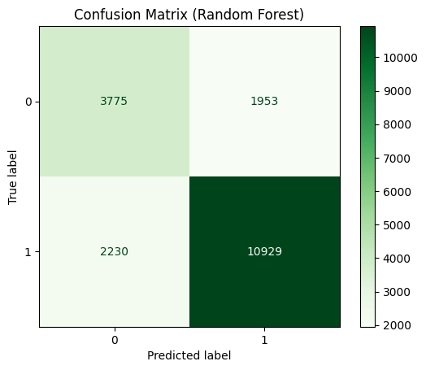

# Predicting Spotify Song Popularity with Python
      
This project applies supervised machine learning to classify songs as *popular* or *unpopular* based on unique audio characteristics. The initial dataset includes 114,000 records and 21 columns comprised of audio features sourced from Spotify. The target variable, popularity (originally a score from 0–100), was binarized using percentile thresholds. After exploration and preprocessing, four classification models were trained on the data set, yielding 78% accuracy at best. 

<ins>**Libraries**</ins>: pandas, Matplotlib, seaborn, numpy, imblearn (SMOTE), scikit-learn, xgboost, spotipy/reccobeats

## Dataset
- **Source**: Kaggle
- **Features**:
  - <ins>acousticness</ins>: A confidence measure from 0.0 to 1.0 of whether the track is acoustic.
  - <ins>danceability</ins>: Danceability describes how suitable a track is for dancing based on a combination of musical elements including tempo, rhythm stability, beat strength, and overall regularity. A value of 0.0 is least danceable and 1.0 is most danceable.
  - <ins>duration_ms</ins>: The duration of the track in milliseconds.
  - <ins>energy</ins>: Energy is a measure from 0.0 to 1.0 and represents a perceptual measure of intensity and activity. Perceptual features contributing to this attribute include dynamic range, perceived loudness, timbre, onset rate, and general entropy.
  - <ins>id</ins>: The Spotify ID for the track (not used in training).
  - <ins>instrumentalness</ins>: Predicts whether a track contains no vocals. "Ooh" and "aah" sounds are treated as instrumental in this context. Rap or spoken word tracks are clearly "vocal". The closer the instrumentalness value is to 1.0, the greater likelihood the track contains no vocal content.
  - <ins>key</ins>: The key the track is in. Integers map to pitches using standard Pitch Class notation (e.g. 0 = C, 1 = C♯/D♭, 2 = D).
  - <ins>liveness</ins>: Detects the presence of an audience in the recording. Higher liveness values represent an increased probability that the track was performed live. A value above 0.8 provides strong likelihood that the track is live.
  - <ins>loudness</ins>: The overall loudness of a track in decibels (dB). Loudness values are averaged across the entire track and are useful for comparing relative loudness of tracks. Loudness is the quality of a sound that is the primary psychological correlate of physical strength (amplitude). Values typically range between -60 and 0 db.
  - <ins>mode</ins>: Mode indicates the modality (major or minor) of a track, the type of scale from which its melodic content is derived. Major is represented by 1 and minor is 0.
  - <ins>speechiness</ins>: Speechiness detects the presence of spoken words in a track. The more exclusively speech-like the recording (e.g. talk show, audio book, poetry), the closer to 1.0 the attribute value. Track speechiness is classified by tertiles.
  - <ins>tempo</ins>: The overall estimated tempo of a track in beats per minute (BPM). In musical terminology, tempo is the speed or pace of a given piece and derives directly from the average beat duration.
  - <ins>time signature</ins>: An estimated time signature. The time signature (meter) is a notational convention to specify how many beats are in each bar (or measure). The time signature ranges from 3 to 7 indicating time signatures of "3/4", to "7/4".
  - <ins>valence</ins>: A measure from 0.0 to 1.0 describing the musical positiveness conveyed by a track. Tracks with high valence sound more positive (e.g. happy, cheerful, euphoric), while tracks with low valence sound more negative (e.g. sad, depressed, angry).
  - <ins>**popularity**</ins>: The popularity of a track is a value between 0 and 100, with 100 being the most popular. The popularity is calculated by algorithm and is based, in the most part, on the total number of plays the track has had and how recent those plays are. 
 
## Methodology
1. EDA and Data Cleaning
   - Dropped innacurate values, irrelevant genres, and duplicate + null records.
   - Visualized data with Matplotlib + seaborn to assess how to preprocess the data.
   - Dropped tracks with popularity = 0 to address skew.
   - Mitigated multicollinearity using correlation heatmaps.
  
2. Preprocessing
   - Split popularity at the 70th percentile and binarized to consider tracks 'popular' (= 1) above that threshold. Cutoff chosen to balance classes (pre-SMOTE) as much as possible without compromising on the definition of 'popular'.
   - Log-transformed 'duration_ms' to 'lduration' to address skew (initial range from 24266 to 5237295 ms).
   - Standardized the features using sklearn.preprocessing.StandardScaler.
   - Applied SMOTE (Synthetic Minority Over-sampling Technique) to address class imbalance.
     - Imbalanced: 65,797 (unpopular), 28,638 (popular)
     - Balanced: 52,638 (unpopular), 52,638 (popular)

3. Modeling, Tuning, Evaluation
   - Model features: 'lduration', 'danceability', 'energy', 'loudness', 'acousticness', 'instrumentalness', 'valence', 'liveness'
   - Models tested: LogisticRegression, RandomForestClassifier, KNeighborsClassifier, XGBClassifier.
   - Hyperparameter tuning for each model using sklearn.model_selection.GridSearchCV.
   - Cross validation using sklearn.model_selection.StratifiedKFold.
   - Assessed feature importance using sklearn.inspection.permutation_importance.
   - Evaluated each model using their accuracy, confusion matrix, and ROC curve.

## Results 
Model | Accuracy | Precision | Recall | AUC |
------|----------|-----------|--------|-----|
Logistic Regression | 0.58 | 0.64 | 0.38 | 0.64 |
**_Random Forest_** | **0.78** | 0.66 | **0.63** | **0.84** |
K-Nearest Neighbors | 0.72 | **0.71** | 0.53 | 0.80 |
XGBoost | 0.75 | 0.68 | 0.57 | 0.81 |

Random forest consistently outperformed all other models.

## Key Visuals
<kbd>
  
</kbd>
<kbd>
  
</kbd>

---

<kbd>
  
</kbd>

---

<kbd>
  
</kbd>
<kbd>
  
</kbd>

---

<kbd>
  
</kbd>

## Real-World Model Validation
Current audio data sourced from Spotify's Web API (via spotipy + reccobeats) was used to test the immediate validity of the Random Forest model with modest accuracy (mean ~60%). The model was tested on a variety of genres, time periods, and playlists including:
- Billboard Hot 100
- Dance/Club Classics
- Golden Age Hip-Hop
- 00s R&B
- Indie

**Conclusions**: The nature of the popularity variable and its calculation causes model accuracy to decrease depending on the recency of the training data. In this case, the dataset was last updated in 2022, so predicting current popularity from past data becomes increasingly challenging. It it also worth noting that there are many external factors that play into an artist's success: social status, promotion, and current trends can drastically influence the outcome of a release regardless of how "popular" the audio features are. Additionally, only numerical features were included in model training. A solid next step on that note is one-hot encoding for categorical variables (key + mode, genre).

## About Me
I'm a college student majoring in **Data Science and Economics**, passionate about data analytics and its real world applications. 
Feel free to connect via Github or [LinkedIn](linkedin.com/in/ethannbrown/)!
